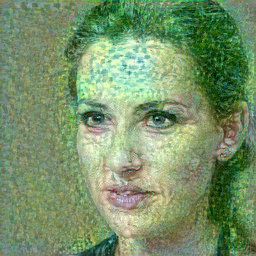

# Neural-Style-Transfer-Sample
Compose an image using the style of another image

## Motivation
- Employ 2 alternatives to compose an image
  - Use a module from TensorFlow Hub
  - Train a deep neural network

## Requirements
- Python 3.x
- TensorFlow 2.x
- Numpy
- Pillow
- TensorFlow Hub

## Sample Data
- Content image `person.jpeg`

  

- Style image `monet.jpg`

  

## Option 1 - Setup to Use the Module from TensorFow Hub
- Clone repository: `git clone https://github.com/jt2002/Neural-Style-Transfer-Sample.git`
- Run the command `python nst_hub.py`
  - The output image `person_nst.jpg` will be created in the `img` folder

    

## Option 2 - Setup to Train the Deep Neural Network
- Clone repository: `git clone https://github.com/jt2002/Neural-Style-Transfer-Sample.git`
- Run the command `python nst_train.py`
  - The output image `person_train_nst.jpg` will be created in the `img` folder

    

#### Notes on Training Deep Neural Network
- The image `person_train_nst.jpg` was trained for 3 epochs and 50 steps per epoch
- The training took 196.4 seconds on MacBook Pro 2.3GHz 8-core i9
  - Training on GPU for at least 10 epochs and 100 steps per epoch is highly recommended
  
- The model utilizes the pretrained image classification network VGG19 where these layers are available 
```
block1_conv1
block1_conv2
block1_pool
block2_conv1
block2_conv2
block2_pool
block3_conv1
block3_conv2
block3_conv3
block3_conv4
block3_pool
block4_conv1
block4_conv2
block4_conv3
block4_conv4
block4_pool
block5_conv1
block5_conv2
block5_conv3
block5_conv4
block5_pool
```
- The code `nst_train.py` sets `content_layers` to `block5_conv2`, and `style_layers` to `['block1_conv1','block2_conv1','block3_conv1','block4_conv1','block5_conv1']`
- Experiment with other layers for `content_layers` and `style_layers` yields interesting images

- The reference tutorial mentions that a lot of high frequency artifacts are created, and decreases them using an explicit regularization term on the high frequency components of the image by replacing `train_step` function with the followings:
```
total_variation_weight=30
@tf.function()
def train_step(image):
  with tf.GradientTape() as tape:
    outputs = extractor(image)
    loss = style_content_loss(outputs)
    loss += total_variation_weight*tf.image.total_variation(image)

  grad = tape.gradient(loss, image)
  opt.apply_gradients([(grad, image)])
  image.assign(clip_0_1(image))
```
- The output image of this update:

    


## References
- Leon A. Gatys’ paper: [A Neural Algorithm of Artistic Style] (https://arxiv.org/abs/1508.06576)
- The codes in this repository are adapted from [Neural Style Transfer tutorials](https://www.tensorflow.org/tutorials/generative/style_transfer)
- The image `person.jpeg` was downloaded from [This person does not exist](https://thispersondoesnotexist.com/)
