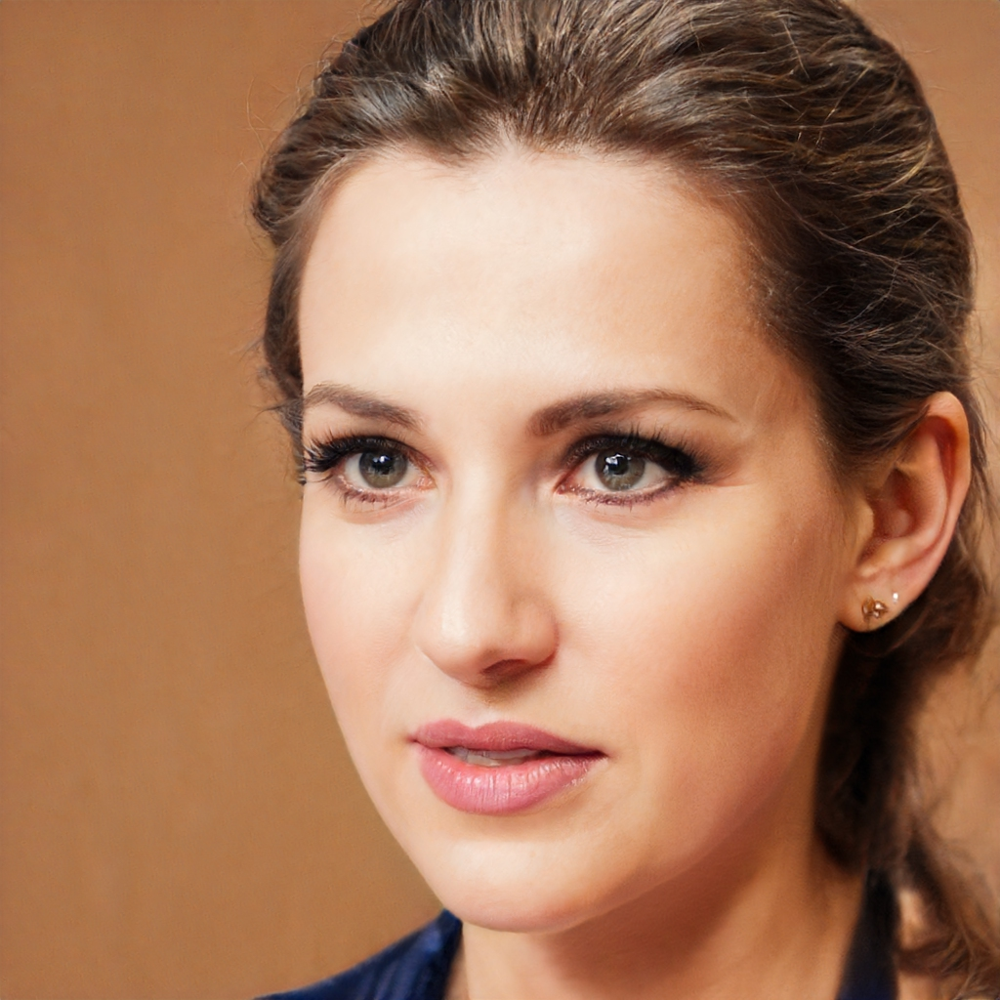
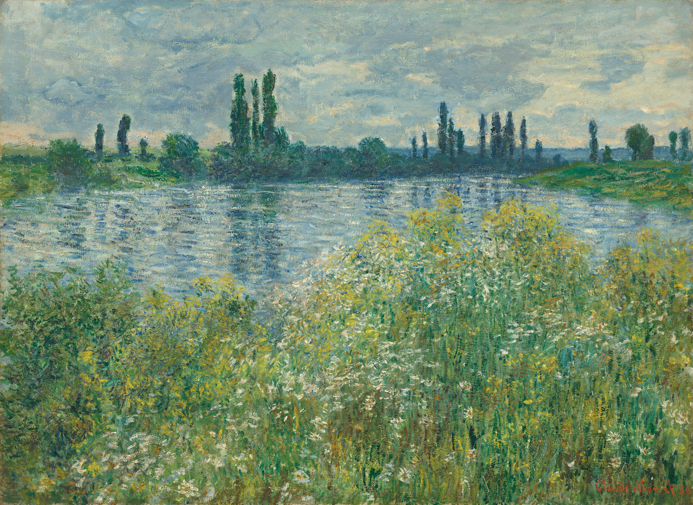
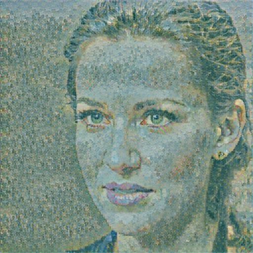
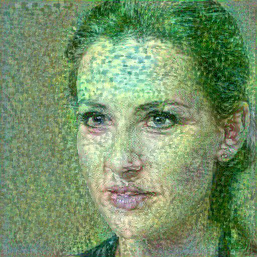

# Neural-Style-Transfer-Sample
Compose an image using the style of another image

## Motivation
- Employ 2 alternatives to compose an image
  - Use a module from TensorFlow Hub
  - Train a deep neural network

## Requirements
- Python 3.x
- TensorFlow 2.x
- Numpy
- Pillow
- TensorFlow Hub

## Sample Data
- Content image `person.jpeg`

  

- Style image `monet.jpg`

  

## Setup to Use the Module from TensorFow Hub
- Clone repository: `git clone https://github.com/jt2002/Neural-Style-Transfer-Sample.git`
- Run the command `python nst_hub.py`
  - The output image `person_nst.jpg` will be created in the `img` folder

    

## Setup to Train the Deep Neural Network
- Clone repository: `git clone https://github.com/jt2002/Neural-Style-Transfer-Sample.git`
- Run the command `python nst_train.py`
  - The output image `person_train_nst.jpg` will be created in the `img` folder

    

### Note on DNN Train
- The image `person_train_nst.jpg` was trained for 3 epochs and 50 steps per epoch

## Reference 
- The codes in this repository are adapted from [Neural Style Transfer tutorials](https://www.tensorflow.org/tutorials/generative/style_transfer)
- The image `person.jpeg` was downloaded from [This person does not exist](https://thispersondoesnotexist.com/)
